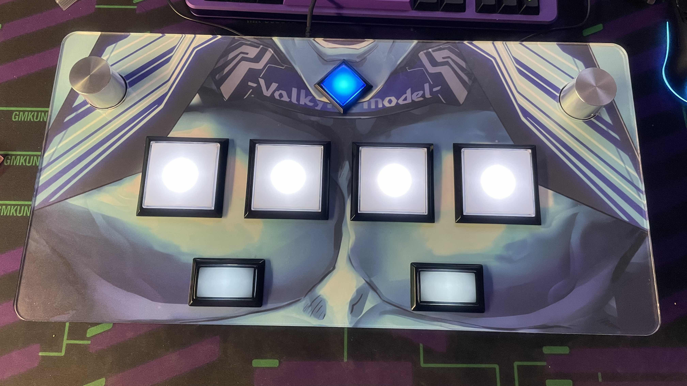

# SDVX-AC-Case
3d printed case for SDVX controller, supports generic chinese rotary encoder and ac knob bracket

Back and Main body in stl folder needs to be mirrored for other side

## BOM
- 1 spool of filament
- x6 M4x16 countersink screw
- x6 M3x12 countersink screw
- x3 M4x25 screw
- x3 M4 Nut
- x2 generic chinese encoder
- x6 M3x8 counter sink screw
- x6 small door magnet
- x12 M3x8 screw
